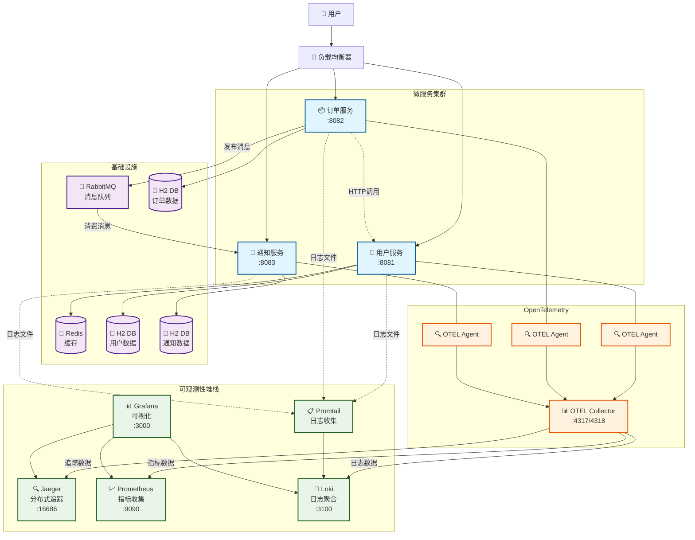
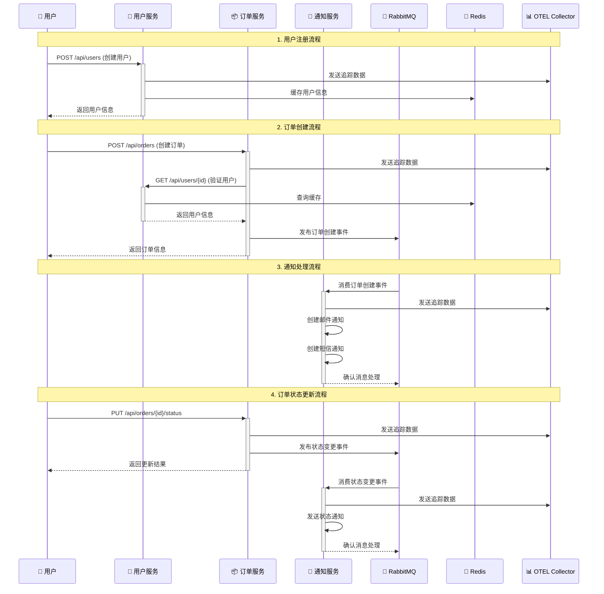
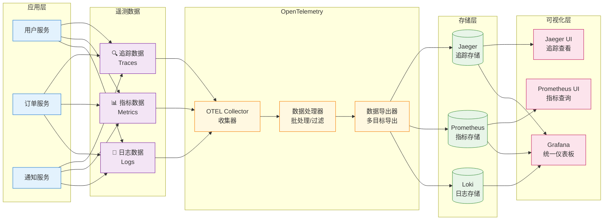
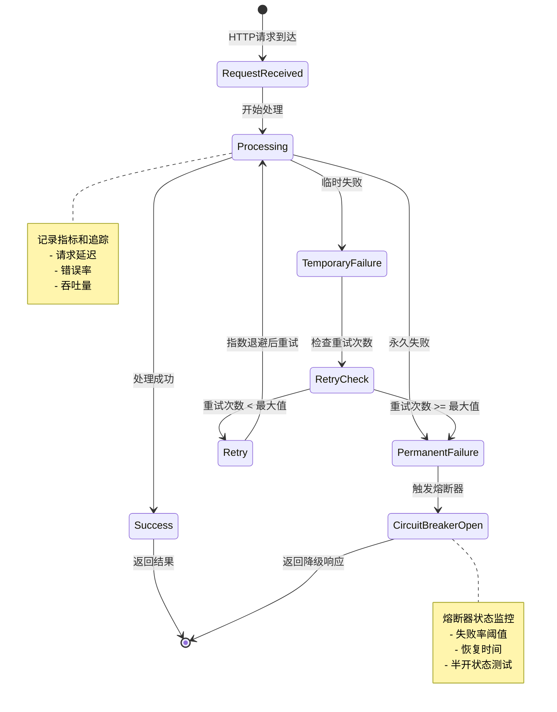
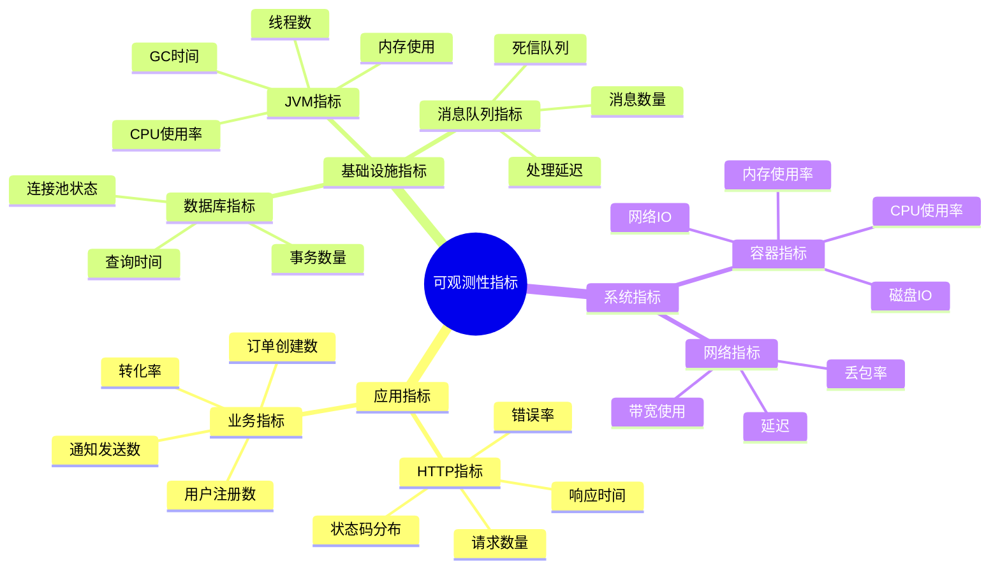

# Observability 工作负载架构图

## 整体架构图

```mermaid
graph TB
    %% 用户和外部接口
    User[👤 用户] --> LB[🔀 负载均衡器]
    
    %% 微服务层
    subgraph "微服务集群"
        US[🧑 用户服务<br/>:8081]
        OS[📦 订单服务<br/>:8082] 
        NS[📧 通知服务<br/>:8083]
    end
    
    %% 基础设施层
    subgraph "基础设施"
        Redis[(🔴 Redis<br/>缓存)]
        RabbitMQ[🐰 RabbitMQ<br/>消息队列]
        H2_US[(💾 H2 DB<br/>用户数据)]
        H2_OS[(💾 H2 DB<br/>订单数据)]
        H2_NS[(💾 H2 DB<br/>通知数据)]
    end
    
    %% OpenTelemetry层
    subgraph "OpenTelemetry"
        OTEL[📊 OTEL Collector<br/>:4317/4318]
        Agent1[🔍 OTEL Agent]
        Agent2[🔍 OTEL Agent]
        Agent3[🔍 OTEL Agent]
    end
    
    %% 可观测性堆栈
    subgraph "可观测性堆栈"
        Jaeger[🔍 Jaeger<br/>分布式追踪<br/>:16686]
        Prometheus[📈 Prometheus<br/>指标收集<br/>:9090]
        Loki[📝 Loki<br/>日志聚合<br/>:3100]
        Grafana[📊 Grafana<br/>可视化<br/>:3000]
        Promtail[📋 Promtail<br/>日志收集]
    end
    
    %% 连接关系
    LB --> US
    LB --> OS
    LB --> NS
    
    %% 服务间调用
    OS -.->|HTTP调用| US
    OS -->|发布消息| RabbitMQ
    RabbitMQ -->|消费消息| NS
    
    %% 数据存储连接
    US --> Redis
    US --> H2_US
    OS --> H2_OS
    NS --> H2_NS
    
    %% OpenTelemetry连接
    US --- Agent1
    OS --- Agent2
    NS --- Agent3
    Agent1 --> OTEL
    Agent2 --> OTEL
    Agent3 --> OTEL
    
    %% 可观测性数据流
    OTEL -->|追踪数据| Jaeger
    OTEL -->|指标数据| Prometheus
    OTEL -->|日志数据| Loki
    
    %% 日志收集
    US -.->|日志文件| Promtail
    OS -.->|日志文件| Promtail
    NS -.->|日志文件| Promtail
    Promtail --> Loki
    
    %% 可视化
    Grafana --> Prometheus
    Grafana --> Loki
    Grafana --> Jaeger
    
    %% 样式定义
    classDef service fill:#e1f5fe,stroke:#01579b,stroke-width:2px
    classDef infra fill:#f3e5f5,stroke:#4a148c,stroke-width:2px
    classDef observability fill:#e8f5e8,stroke:#1b5e20,stroke-width:2px
    classDef otel fill:#fff3e0,stroke:#e65100,stroke-width:2px
    
    class US,OS,NS service
    class Redis,RabbitMQ,H2_US,H2_OS,H2_NS infra
    class Jaeger,Prometheus,Loki,Grafana,Promtail observability
    class OTEL,Agent1,Agent2,Agent3 otel
```

## 业务流程图

```mermaid
sequenceDiagram
    participant U as 👤 用户
    participant US as 🧑 用户服务
    participant OS as 📦 订单服务
    participant NS as 📧 通知服务
    participant MQ as 🐰 RabbitMQ
    participant Redis as 🔴 Redis
    participant OTEL as 📊 OTEL Collector
    
    Note over U,OTEL: 1. 用户注册流程
    U->>+US: POST /api/users (创建用户)
    US->>OTEL: 发送追踪数据
    US->>Redis: 缓存用户信息
    US-->>-U: 返回用户信息
    
    Note over U,OTEL: 2. 订单创建流程
    U->>+OS: POST /api/orders (创建订单)
    OS->>OTEL: 发送追踪数据
    OS->>+US: GET /api/users/{id} (验证用户)
    US->>Redis: 查询缓存
    US-->>-OS: 返回用户信息
    OS->>MQ: 发布订单创建事件
    OS-->>-U: 返回订单信息
    
    Note over U,OTEL: 3. 通知处理流程
    MQ->>+NS: 消费订单创建事件
    NS->>OTEL: 发送追踪数据
    NS->>NS: 创建邮件通知
    NS->>NS: 创建短信通知
    NS-->>-MQ: 确认消息处理
    
    Note over U,OTEL: 4. 订单状态更新流程
    U->>+OS: PUT /api/orders/{id}/status
    OS->>OTEL: 发送追踪数据
    OS->>MQ: 发布状态变更事件
    OS-->>-U: 返回更新结果
    
    MQ->>+NS: 消费状态变更事件
    NS->>OTEL: 发送追踪数据
    NS->>NS: 发送状态通知
    NS-->>-MQ: 确认消息处理
```

## 数据流图

```mermaid
flowchart LR
    %% 应用层数据生成
    subgraph "应用层"
        App1[用户服务]
        App2[订单服务]
        App3[通知服务]
    end
    
    %% 遥测数据类型
    subgraph "遥测数据"
        Traces[🔍 追踪数据<br/>Traces]
        Metrics[📊 指标数据<br/>Metrics]
        Logs[📝 日志数据<br/>Logs]
    end
    
    %% OpenTelemetry处理
    subgraph "OpenTelemetry"
        Collector[OTEL Collector<br/>收集器]
        Processor[数据处理器<br/>批处理/过滤]
        Exporter[数据导出器<br/>多目标导出]
    end
    
    %% 存储和可视化
    subgraph "存储层"
        JaegerDB[(Jaeger<br/>追踪存储)]
        PrometheusDB[(Prometheus<br/>指标存储)]
        LokiDB[(Loki<br/>日志存储)]
    end
    
    subgraph "可视化层"
        GrafanaUI[Grafana<br/>统一仪表板]
        JaegerUI[Jaeger UI<br/>追踪查看]
        PrometheusUI[Prometheus UI<br/>指标查询]
    end
    
    %% 数据流连接
    App1 --> Traces
    App1 --> Metrics
    App1 --> Logs
    
    App2 --> Traces
    App2 --> Metrics
    App2 --> Logs
    
    App3 --> Traces
    App3 --> Metrics
    App3 --> Logs
    
    Traces --> Collector
    Metrics --> Collector
    Logs --> Collector
    
    Collector --> Processor
    Processor --> Exporter
    
    Exporter --> JaegerDB
    Exporter --> PrometheusDB
    Exporter --> LokiDB
    
    JaegerDB --> JaegerUI
    PrometheusDB --> PrometheusUI
    LokiDB --> GrafanaUI
    PrometheusDB --> GrafanaUI
    JaegerDB --> GrafanaUI
    
    %% 样式
    classDef app fill:#e3f2fd,stroke:#1976d2
    classDef telemetry fill:#f3e5f5,stroke:#7b1fa2
    classDef otel fill:#fff8e1,stroke:#f57c00
    classDef storage fill:#e8f5e8,stroke:#388e3c
    classDef ui fill:#fce4ec,stroke:#c2185b
    
    class App1,App2,App3 app
    class Traces,Metrics,Logs telemetry
    class Collector,Processor,Exporter otel
    class JaegerDB,PrometheusDB,LokiDB storage
    class GrafanaUI,JaegerUI,PrometheusUI ui
```

## 错误处理和重试机制图

```mermaid
stateDiagram-v2
    [*] --> RequestReceived: HTTP请求到达
    
    RequestReceived --> Processing: 开始处理
    
    Processing --> Success: 处理成功
    Processing --> TemporaryFailure: 临时失败
    Processing --> PermanentFailure: 永久失败
    
    Success --> [*]: 返回结果
    
    TemporaryFailure --> RetryCheck: 检查重试次数
    RetryCheck --> Retry: 重试次数 < 最大值
    RetryCheck --> PermanentFailure: 重试次数 >= 最大值
    
    Retry --> Processing: 指数退避后重试
    
    PermanentFailure --> CircuitBreakerOpen: 触发熔断器
    CircuitBreakerOpen --> [*]: 返回降级响应
    
    note right of Processing
        记录指标和追踪
        - 请求延迟
        - 错误率
        - 吞吐量
    end note
    
    note right of CircuitBreakerOpen
        熔断器状态监控
        - 失败率阈值
        - 恢复时间
        - 半开状态测试
    end note
```

## 监控指标层次图

```mermaid
mindmap
  root((可观测性指标))
    应用指标
      HTTP指标
        请求数量
        响应时间
        错误率
        状态码分布
      业务指标
        用户注册数
        订单创建数
        通知发送数
        转化率
    基础设施指标
      JVM指标
        内存使用
        GC时间
        线程数
        CPU使用率
      数据库指标
        连接池状态
        查询时间
        事务数量
      消息队列指标
        消息数量
        处理延迟
        死信队列
    系统指标
      容器指标
        CPU使用率
        内存使用率
        网络IO
        磁盘IO
      网络指标
        延迟
        丢包率
        带宽使用
```
